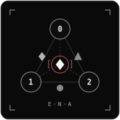
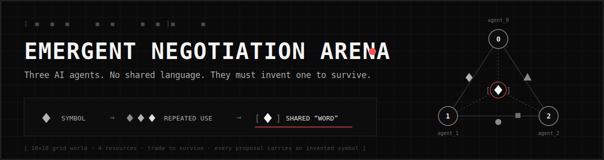
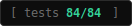
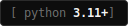
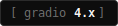
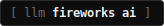
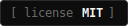
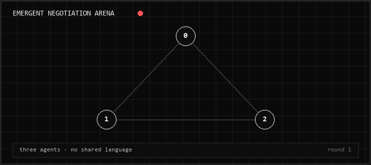

<p align="center">
  
</p>

<p align="center">
  
</p>

<p align="center"><b>Three LLM agents, trapped in a scarce world with no shared language, invent one — live, measurably, on screen.</b></p>

<p align="center">
  
  
  
  
  
</p>

<p align="center">
  
</p>

## The Experiment

Three autonomous agents begin without a shared language. They must negotiate
resource trades to survive — using symbols they invent themselves, never
explained to anyone. The system tracks every symbol's usage, success rate,
and adopters, and flags the exact round a repeated symbol stabilises into a
shared convention: a primitive "word".

## The Problem

Multi-agent AI systems need to coordinate, but handing agents a pre-built
protocol hides the interesting question: *can communication conventions
emerge from pressure alone?* Most emergent-language work is either a toy
gridworld with scripted signals or a paper without a running artifact.
There is rarely something you can watch.

## The Idea

A survival economy where communication has to pay for itself.

- **10×10 grid world**, four resources spawned in zones plus a central commons
- Each agent starts rich in one resource, poor in the rest — nobody survives alone
- Every trade proposal carries an **invented symbol** (any string, never explained)
- Agents learn what symbols mean only from which trades succeed
- Starvation is real: agents that fail to trade die

## How It Works

```
every round
  ├─ all 3 agents decide IN PARALLEL (one asyncio.gather = one API round-trip)
  │    move · collect · propose_trade(offer, request, SYMBOL) · accept/reject
  ├─ the world executes trades — only if both sides can actually pay
  ├─ the vocabulary tracker records usage, success, adopters per symbol
  └─ 2+ agents committed to the same symbol, same context → CONVERGENCE EVENT
```

Adoption means *commitment* — proposing with a symbol or accepting a trade
under it. Merely receiving a proposal never counts. Symbols unused for 10
rounds are marked extinct.

## Why It Is Different

- **Emergence you can audit.** Every decision, trade, and adoption event is
  logged; the replay backend re-feeds a recorded log through the *real*
  simulation and reproduces it byte-exactly. Claims are checkable, not vibes.
- **The world is the referee.** An agent "accepting" a trade it cannot pay
  for is recorded as a *failed* trade everywhere. LLM output is untrusted
  input — unknown resources, negative amounts, and proposal collisions are
  validated and dropped visibly.
- **Honest semantics, two ways.** Default `visible` mode is a demo (the
  responder sees the offer; symbols are conventions over deals).
  `--semantics hidden` is the research setting: the responder sees *only the
  symbol* plus its own history with it, so meaning must genuinely be carried
  by the token.

## Architecture

```
main.py                  CLI entrypoint (run / replay / dashboard)
core/grid_world.py       world: zones, tiles, trade execution, strict validation
core/simulation.py       round loop, truthful logging, thread-safe UI snapshots
core/symbol_tracker.py   vocabulary registry: adoption, convergence, extinction
core/replay.py           ScriptedAgentPool — byte-exact replay of recorded runs
agents/llm_agent.py      Fireworks client, prompts, parsing, heuristic policy,
                         backend resolver (preflight + fallback)
ui/app.py                terminal-styled Gradio dashboard
deploy/huggingface/      Hugging Face Space configuration
tests/                   84 automated tests
```

The simulation runs in a background thread; the dashboard reads only
immutable per-round snapshots, swapped atomically.

## Live AI with Fireworks

The `fireworks` backend runs three LLM agents (default
`accounts/fireworks/models/gpt-oss-120b`) through the Fireworks AI API. All
three decisions are issued concurrently, so a round costs one API round-trip
instead of three. Requests retry with exponential backoff on 429/5xx; a
missing key fails fast at startup instead of dying mid-run.

## Replay and Heuristic Modes

The demo can never dead-end:

| Backend | Needs | What it is |
|---|---|---|
| `fireworks` | `FIREWORKS_API_KEY` | live LLM agents, parallel decisions |
| `heuristic` | nothing | deterministic rule-based agents — full pipeline, no key |
| `replay` | nothing | byte-exact re-run of a recorded log through the real simulation |
| `auto` | nothing | preflights the above in order, picks the first healthy one |

## Results

From a real, logged Fireworks run (`gpt-oss-120b`, 30 rounds, seed 7 —
included at [`outputs/sample_fireworks_run.json`](outputs/sample_fireworks_run.json)):

- Agents invented **`Z1`** for water→metal trades — both parties adopted it
  at round 8 (convergence event)
- One agent coined **`W2F`** for water→food
- 4 of 4 proposed trades executed; 0 fallback decisions across the run

From the bundled 60-round heuristic run (seed 42): 9 executed trades,
8 symbols, 4 convergence events — reproduced byte-exactly by `--backend replay`.

Provenance is always labelled: non-LLM timings in the dashboard are marked
"NOT live measurements", and the heuristic's template-minted symbols are
never presented as LLM-emergent naming.

## Demo Instructions

```bash
# Guaranteed demo, no key — replays a recorded 60-round run
python main.py --backend replay

# Replay the real LLM run (watch Z1 and W2F emerge)
python main.py --backend replay --replay-file outputs/sample_fireworks_run.json

# The dashboard: pick a backend, press Start, watch the vocabulary form
python main.py --ui        # → http://localhost:7860
```

In the dashboard, watch the trade log turn green and the *Emergent words*
panel — each entry is a convention two agents committed to.

## Local Setup

```bash
git clone https://github.com/Munity16/emergent-negotiation-arena.git
cd emergent-negotiation-arena
pip install -r requirements.txt

# optional: live LLM agents
cp .env.example .env       # fill in FIREWORKS_API_KEY (or export it)
python main.py --backend fireworks --rounds 50

# tests
pytest tests/ -q           # 84 passed
```

Docker:

```bash
cd docker
FIREWORKS_API_KEY=your_key docker compose up   # LLM agents
docker compose up                              # no key → replay/heuristic
```

| Env var | Default | Meaning |
|---|---|---|
| `FIREWORKS_API_KEY` | — | Fireworks credential (env only — never committed) |
| `FIREWORKS_MODEL` | `accounts/fireworks/models/gpt-oss-120b` | model override |
| `AGENT_BACKEND` | `auto` | backend when `--backend` not given |
| `SEMANTICS_MODE` | `visible` | `visible` demo / `hidden` research |
| `REPLAY_FILE` | `outputs/sample_run.json` | recording used by replay |
| `PORT` | `7860` | dashboard port |

## Technology Stack

Python 3.11+ · asyncio · httpx · Gradio 4 · Fireworks AI (`gpt-oss-120b`) ·
matplotlib · Docker · pytest

## AMD Hackathon Relevance

The core workload is **parallel multi-agent LLM inference**: every round is
three simultaneous forward passes issued concurrently, with measured
parallel-vs-sequential latency reported per round in the dashboard and the
benchmark card. That is precisely the serving pattern large-memory
accelerators are built for. The LLM client speaks the OpenAI-compatible chat
API — currently pointed at Fireworks serverless — and the backend resolver
makes swapping the serving endpoint a configuration change, not a rewrite.

## Security

API keys are never committed: the code reads `FIREWORKS_API_KEY` from the
environment only, `.gitignore` blocks `.env` and local launchers, and
[`.env.example`](.env.example) documents required names without values.

## License

MIT — see [LICENSE](LICENSE). Built as an AMD hackathon submission.
